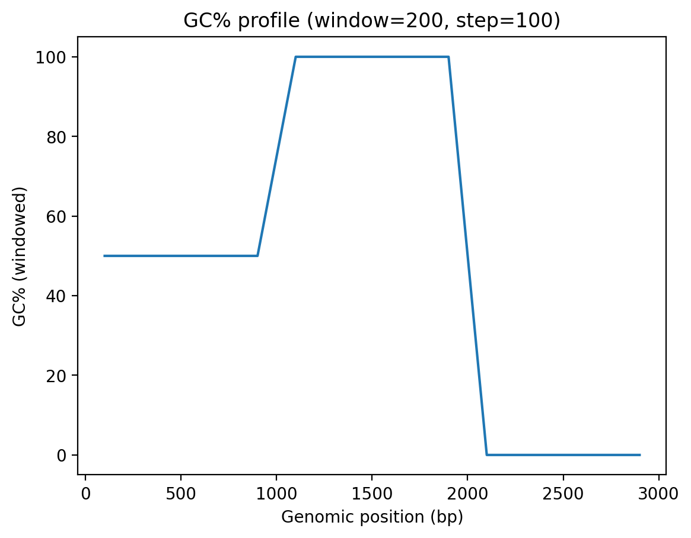
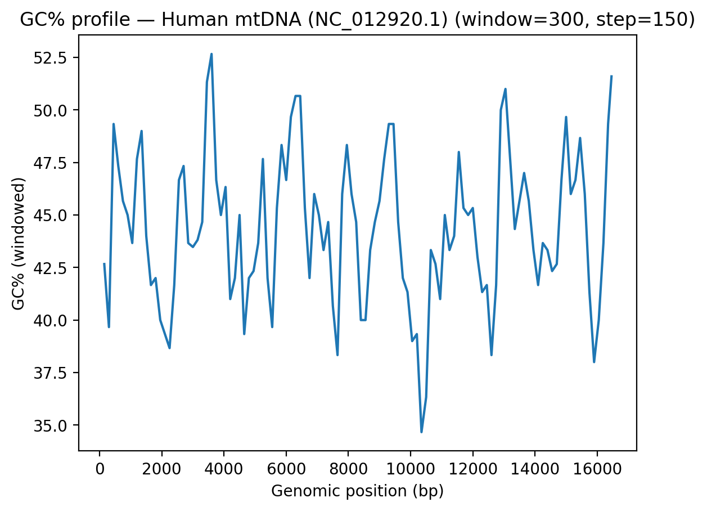
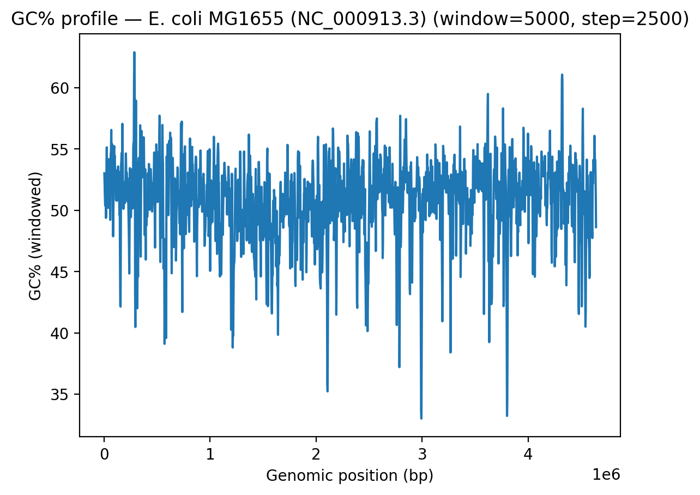
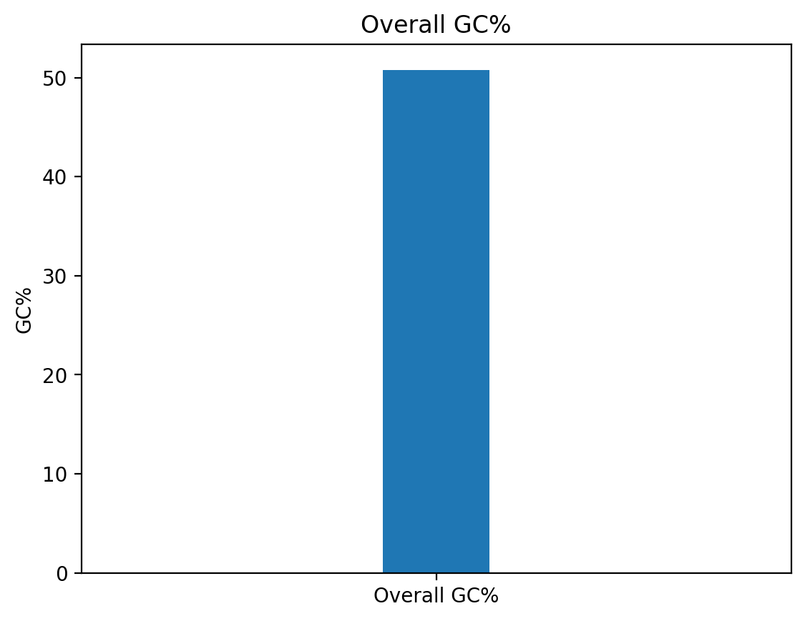

# GC Content + Sliding Window (Beginner → Useful)

A simple, reproducible **Jupyter** workflow to compute **overall GC%** and **sliding-window GC profiles** from any DNA **FASTA** file. GC% analysis is a foundational genomics **quality-control** step: it helps spot compositional biases, sequencing artefacts, and GC-rich/poor regions that often map to functional elements.

- 📓 Notebooks: toy demo + real FASTA analyses  
- 📊 Outputs: publication-ready **figures (PNG)** and **tables (CSV)**  
- 🧪 Inputs: any **.fasta / .fa / .fna** sequence

---

## Introduction / Goal

This project shows, end-to-end, how to:
- Compute **overall GC%** for a sequence
- Generate a **sliding-window GC% profile** across the genome
- Save results as **CSV tables** and **figures** for reports and QC

It starts with a toy sequence (for clarity), then extends the pipeline to **real genomes**:
- **Human mitochondrial DNA** (rCRS, **NC_012920.1**)  
- ***Escherichia coli* K-12 MG1655** (**NC_000913.3**)

The notebooks are **beginner-friendly** and designed to be adapted to any FASTA input.

---

## Methods

**Environment:** Python (Jupyter), standard library + Matplotlib.

1) **FASTA parsing**  
   - Lightweight reader concatenates sequence lines, extracts header.

2) **GC% computation**  
   - **Overall GC%** = (G + C) / (A + C + G + T) × 100  
   - **Sliding windows**: configurable `window` & `step` to compute GC% per window.

3) **Outputs**  
   - **CSV** of all windows; **top/bottom 10** windows by GC%  
   - **Figures**: line plot (GC% vs position) and single-bar overall GC%

4) **Real genomes**  
   - FASTA retrieved from NCBI (RefSeq accessions below).  
   - Parameters tuned to genome size (e.g., mtDNA: smaller window; *E. coli*: larger).

---

## Results

### Toy demo (synthetic DNA)
- **GC% profile:**  
  
- **Overall GC:**  
  

### Human mtDNA (NC_012920.1)
- **GC% profile:**  
  
- **Overall GC:**  
  
- **Tables:**  
  - All windows: [`results/mtDNA/gc_windows.csv`](gc_windows_mtdna.csv)  
  - Extremes (top/bottom 10): [`results/mtDNA/gc_extremes.csv`](gc_extremes_mtdna.csv)

### *E. coli* K-12 MG1655 (NC_000913.3)
- **GC% profile:**  
  
- **Overall GC:**  
  
- **Tables:**  
  - All windows: [`results/ecoli/gc_windows.csv`](gc_windows_ecoli.csv)  
  - Extremes (top/bottom 10): [`results/ecoli/gc_extremes.csv`](gc_extremes_ecoli.csv)

---

## Reproduce / Use on your own FASTA

1. Open the notebooks in **Jupyter** (Anaconda → Jupyter).  
2. In the “real FASTA” notebook, set `fasta_path` to your `.fasta/.fa/.fna`.  
3. Choose `window`/`step` (smaller for short genomes; larger for long chromosomes).  
4. Run all cells. Outputs (PNGs/CSVs) will be written under `results/`.

> Tip: If the single bar looks too “thick,” set `xlim` (e.g., `plt.xlim(-1, 1)`) so the width is visible.

---

## Next Steps

- Add **multi-FASTA** support to batch-run many sequences.  
- Overlay **GC% with annotation tracks** (genes, CDS, CpG islands) for interpretation.  
- Package the notebook logic as a small **Python module/CLI** for easier reuse.

---

## Data Sources

- **Human mitochondrion (rCRS)** — NCBI RefSeq **NC_012920.1**  
  FASTA viewer: https://www.ncbi.nlm.nih.gov/sviewer/viewer.fcgi?id=NC_012920.1&db=nuccore&report=fasta
- ***Escherichia coli* K-12 substr. MG1655** — NCBI RefSeq **NC_000913.3**  
  FASTA viewer: https://www.ncbi.nlm.nih.gov/sviewer/viewer.fcgi?id=NC_000913.3&db=nuccore&report=fasta

---

## License

This repository is open-sourced under the **MIT License**. See [`LICENSE`](LICENSE).

